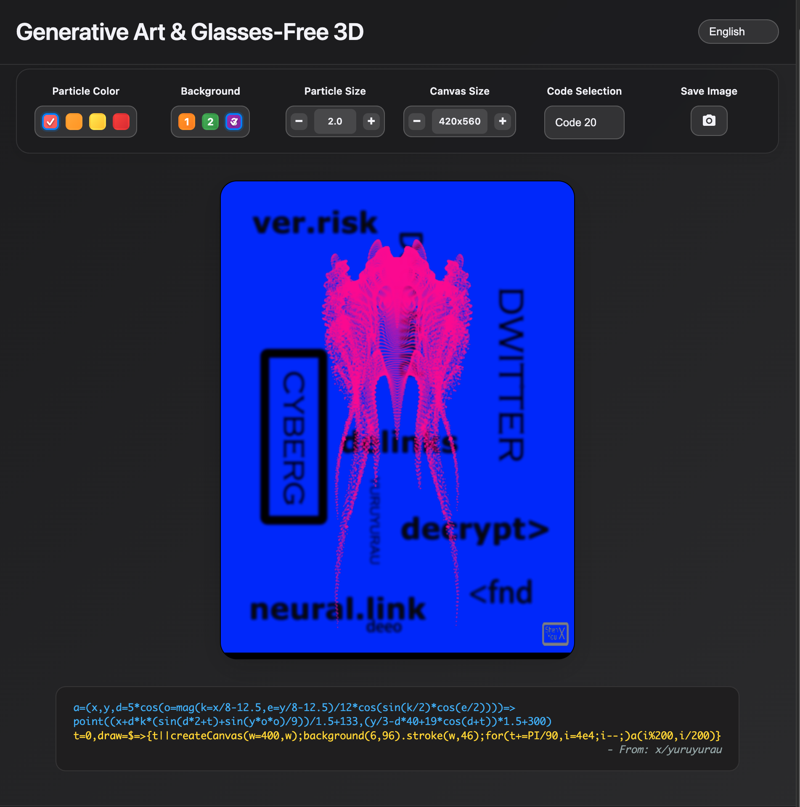

# Generative Art & Glasses-Free 3D

## [Demo Online](https://shanehsu08.github.io/GenerativeArt3D/genart3d.html)

[中文](README_zh.md) | [日本語](README_ja.md)

## UI Preview



## Background

This project merges two fascinating forms of visual art: **Generative Art** and **Glasses-Free 3D Effects**, creating an immersive and interactive experience.

### Formula Origins: Dwitter and Code Art

The core mathematical formulas are inspired by **Dwitter.net**, a creative coding community where artists share visuals generated from extremely short JavaScript code (often under 140 characters). This constraint fosters a "code-golfing" culture, where artists use clever math and programming to create stunningly complex visuals from a tiny footprint.

Many of the code variations in this project are adapted from or inspired by the work of Twitter user **[@ア](https://twitter.com/yuruyurau)**, a prominent creator in this space.

### Glasses-Free 3D: The "Chromostereopsis" Effect

The "glasses-free 3D" in this project isn't true 3D rendering but a clever use of a visual phenomenon called **Chromostereopsis**. Here's how it works:

The human eye's lens refracts different wavelengths of light at slightly different angles. Longer wavelengths (like red) focus slightly behind the retina, while shorter wavelengths (like blue) focus slightly in front. When processing these signals, the brain perceives red objects as closer and blue objects as farther away.

This effect is especially pronounced when vibrant red particles are placed on a deep blue background, creating a natural sense of depth that makes the image appear three-dimensional.

### An Enhanced Effect with Myopia (Nearsightedness)

This 3D effect can be even more pronounced for individuals with myopia (nearsightedness) when they are wearing their prescription glasses. Concave lenses, used to correct myopia, also produce chromatic aberration. When light passes through both the glasses and the eye's natural lens, the chromatic aberration from both sources combines, amplifying the separation between red and blue focal points. This sends a stronger "depth" signal to the brain, making the 3D effect "pop." The intensity of this enhancement can vary depending on the glasses' material and prescription strength.

### Project's Contribution

This project's main contribution is the **systematic organization of these sophisticated generative art formulas, combined with the Chromostereopsis effect**. By allowing users to customize particle and background, it provides a tool to trigger and control this glasses-free 3D phenomenon. The result transforms flat mathematical art into a dynamic, three-dimensional visual experience.

## Features

### 🎨 Diverse Artistic Effects
- **48 Different Code Variations**: Each based on a unique mathematical formula for distinct visuals.
- **Real-time Animation**: Dynamic effects driven by a time variable for fluid particle motion.
- **Math-Driven**: Art generated using trigonometric functions, exponential functions, and more.

### 🎛️ Customizable Visual Parameters
- **Particle Color**: Choose from 4 presets (Red, Orange, Yellow, Pure Red).
- **Background**: Choose from 3 presets.
- **Particle Size**: Adjust particle size from 0.5 to 3.0.
- **Canvas Size**: Adjust a base multiplier from 120 to 250. The canvas maintains a 3:4 aspect ratio, resulting in final dimensions ranging from 360x480 to 750x1000 pixels.

### 🌐 Multi-Language Support
Supports 7 interface languages:
- 中文 (Simplified Chinese)
- English
- 日本語
- 한국어
- Deutsch
- Français
- العربية

### 📱 Responsive Design
- Adapts to different screen sizes.
- Mobile-friendly user interface.
- Modern dark theme design.

### 📸 Image Saving
- **One-Click Save**: Save the current artwork with a single click on the camera icon.
- **Smart Naming**: Automatically generates filenames with the code version and timestamp.
- **High-Quality PNG**: Saves in lossless PNG format for clear images.
- **Consistent Sizing**: The saved image dimensions match the displayed canvas size.

## Tech Stack

- **HTML5 Canvas**: For graphics rendering.
- **p5.js**: A JavaScript library for creative coding.
- **CSS3**: For modern styling.
- **JavaScript ES6+**: For core logic.
- **Single-file structure for easy deployment.**

## Project Structure

```
GenerativeArt3D/
├── genart3d.html           # Main HTML file
└── README.md              # Project documentation
```

## Quick Start

### Deployment

#### 1. Local Deployment
```bash
# Clone the project
git clone <repository-url>
cd GenerativeArt3D

# Open the HTML file directly in your browser
open genart3d.html
```

#### 2. Web Server Deployment
```bash
# Start a simple HTTP server with Python
python -m http.server 8000

# Or use Node.js http-server
npx http-server

# Then visit http://localhost:8000 in your browser
```

#### 3. GitHub Pages Deployment
1. Upload the project to a GitHub repository.
2. In repository settings, enable GitHub Pages.
3. Select the `main` branch as the source.
4. Visit `https://YourUsername.github.io/YourRepo/genart3d.html`.

#### 4. Netlify Deployment
1. Drag and drop the project folder onto the Netlify deploy page.
2. Or connect your GitHub repository for automatic deployment.
3. Get your automatically generated URL.

## Usage

1. **Select Art Effect**: Choose a code variation from the dropdown menu.
2. **Adjust Colors**: Change particle colors and background.
3. **Adjust Sizes**: Use the +/- buttons to change particle and canvas sizes.
4. **Switch Language**: Select your preferred language.
5. **Save Image**: Click the camera icon to save the artwork as a high-quality PNG file. The filename is automatically generated (e.g., `generative-art-code20-2025-07-28_16-52-55.png`).

### Parameter Guide
- **Code Selection**: Choose from 48 different mathematical algorithms, each creating a unique visual.
- **Particle Color**: Sets the color of the moving points. To best experience the 3D effect, use a Red/Orange particle on a Blue/Black background.
- **Background**: Sets the canvas background.
- **Particle Size**: Controls the diameter of the drawn points.
- **Canvas Size**: Adjusts the canvas dimensions.
- **Save Image**: Captures the current canvas content.

## How It Works: The Math

The visuals are generated by mathematical formulas that calculate the position of each particle for every frame. These formulas often include:

- **Trigonometric Functions**: `sin()`, `cos()`, and `tan()` for periodic motion.
- **Vector Operations**: The `mag()` function (magnitude) to calculate distances.
- **A Time Variable (`t`)**: Used to evolve the animation over time.
- **Coordinate Transformations**: Complex mapping and rotations to create intricate patterns.

**Important Note for Developers**: This project is optimized for formulas that render visuals point-by-point using the `point()` function (i.e., particle systems). Formulas that rely on other p5.js drawing functions like `line()`, `rect()`, or `ellipse()` may require code modifications to work correctly.

Example Formula:
```javascript
a=(x,y,d=mag(k=(4+sin(y*2-t)*3)*cos(x/29),e=y/8-13))=>
  point((q=3*sin(k*2)+.3/k+sin(y/25)*k*(9+4*sin(e*9-d*3+t*2)))+
        30*cos(c=d-t)+200,q*sin(c)+d*39-220)
```

## Browser Compatibility

- Chrome 60+
- Firefox 55+
- Safari 12+
- Edge 79+

## Contribution Guide

Contributions of new artistic effects or improvements are welcome!

1. Fork the project.
2. Create a feature branch: `git checkout -b feature/new-effect`
3. Commit your changes: `git commit -am 'Add new artistic effect'`
4. Push to the branch: `git push origin feature/new-effect`
5. Create a Pull Request.

## Acknowledgements

- Art Algorithm Sources: [@ア](https://twitter.com/yuruyurau), [Dwitter](https://dwitter.net)
- Creative Coding Library: [p5js.org](https://p5js.org/)
- Inspiration for mathematical beauty from geometric patterns in nature.

## License

MIT License

## Contact

For questions, suggestions, or new formula submissions, please create a GitHub Issue.

---
## [Demo Online](https://shanehsu08.github.io/GenerativeArt3D/genart3d.html)

*Where math and art merge in code* ✨ 