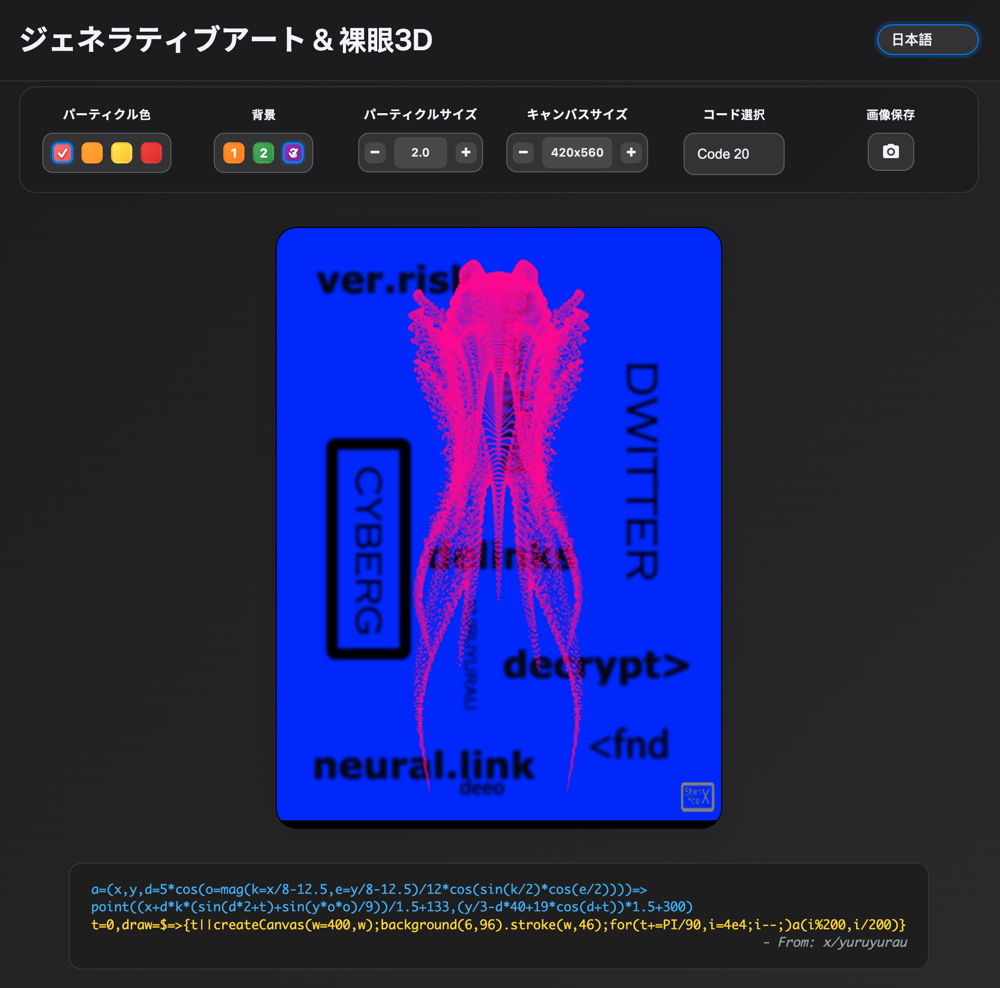

# ジェネラティブアート &amp; 裸眼3D

[英文版](README.md) | [中文版](README_zh.md)

## UIプレビュー



## 背景

このプロジェクトは、**ジェネラティブアート**と**裸眼3D効果**という2つの魅力的な視覚芸術を融合させ、没入感のあるインタラクティブな体験を創造します。

### 数式の起源：Dwitterとコードアート

このプロジェクトで利用している数式は、クリエイティブコーディングのコミュニティサイト**Dwitter.net**から着想を得ています。Dwitterは、極端に短いJavaScriptコード（多くは140文字以下）で生成されたビジュアルアートを共有するプラットフォームです。この制約が、アーティストたちに数学とプログラミングの技巧を凝らさせ、ごく僅かなコードから驚くほど複雑なビジュアルを生み出す「コードゴルフ」という独特の文化を育みました。

Twitterユーザーの**[@ア](https://twitter.com/yuruyurau)**氏は、この分野における著名なクリエイターです。このプロジェクトに含まれるコードバリエーションの多くは、氏の作品や公開されている知見から着想を得て、改変・応用したものです。

### 裸眼3D：「色立体視」効果について

このプロジェクトが提供する「裸眼3D」は、純粋な3Dレンダリングではなく、**色立体視（Chromostereopsis）** という視覚現象を巧みに応用したものです。その仕組みは以下の通りです。

人間の目の水晶体は、光の波長に応じて屈折する角度がわずかに異なります。赤のような長波長の光は網膜の少し奥で焦点を結び、青のような短波長の光は少し手前で焦点を結びます。脳がこれらの光の情報を処理する際、赤い物体を「より手前」に、青い物体を「より奥」にあると知覚します。

この効果は、鮮やかな赤色のパーティクルを暗い青色の背景に配置した際に特に顕著に現れ、自然な奥行き感を生み出して、平面のイメージを立体的に見せます。

### 近視（Nearsightedness）と効果の増幅

この3D効果は、近視の方が補正メガネ（凹レンズ）をかけて見ることで、さらに強く感じられる場合があります。近視用の凹レンズもまた色収差を生じさせるため、メガネと目の水晶体の両方で発生する色収差が重なり合い、赤と青の焦点のズレを増幅させるからです。これにより、脳へと送られる「奥行き」の信号がより強力になり、3D効果が際立って感じられます。この効果の強さは、メガネの材質や度数によって変化します。

### このプロジェクトの貢献

このプロジェクトの主な貢献は、**洗練されたジェネラティブアートの数式を体系的に整理し、それを色立体視の効果と組み合わせた**点にあります。パーティクルや背景の色をユーザーが自由にカスタマイズできるようにすることで、この裸眼3D現象の発生をコントロールし、平面的な数学アートをダイナミックで立体的なビジュアル体験へと変化させるツールを提供します。

## 主な機能

### 🎨 多彩なアート表現
- **40種類のコードバリエーション**：それぞれ独自の数式に基づき、異なるビジュアルを生成します。
- **リアルタイム・アニメーション**：時間変数 `t` を用いた滑らかなパーティクルの動きが、ダイナミックな表現を生み出します。
- **数式による描画**：三角関数や指数関数などを駆使してアートを生成します。

### 🎛️ カスタマイズ可能なパラメータ
- **パーティクルカラー**：4つのプリセット（赤、オレンジ、黄、純赤）から選択できます。
- **背景色**：4つのプリセット（青、シアン、紫、黒）から選択できます。
- **パーティクルサイズ**：0.5から3.0の範囲で調整可能です。
- **キャンバスサイズ**：基準となる数値を120から250の間で調整できます。キャンバスは3:4の比率を保つため、最終的な解像度は360x480から750x1000ピクセルの範囲で変化します。

### 🌐 多言語対応
7つのUI言語に対応しています：
- 中文 (簡体字)
- English
- 日本語
- 한국어
- Deutsch
- Français
- العربية

### 📱 レスポンシブデザイン
- さまざまな画面サイズに対応。
- モバイルフレンドリーなユーザーインターフェース。
- モダンなダークテーマデザイン。

### 📸 画像保存機能
- **ワンクリック保存**：カメラアイコンをワンクリックで現在のアートワークを保存。
- **スマートネーミング**：コードバージョンとタイムスタンプを含むファイル名を自動生成。
- **高品質PNG**：クリアな画質のためにロスレスPNG形式で保存。
- **一貫したサイジング**：保存される画像の寸法は表示されるキャンバスサイズと一致。

## 技術スタック

- **HTML5 Canvas**：グラフィックレンダリング用。
- **p5.js**：クリエイティブコーディング用のJavaScriptライブラリ。
- **CSS3**：モダンスタイリング用。
- **JavaScript ES6+**：コアロジック用。
- **簡単なデプロイのための単一ファイル構造。**

## プロジェクト構造

```
GenerativeArt3D/
├── genart3d.html           # メインHTMLファイル
└── README.md              # プロジェクトドキュメンテーション
```

## クイックスタート

### デプロイ

#### 1. ローカルデプロイ
```bash
# プロジェクトをクローン
git clone <repository-url>
cd GenerativeArt3D

# HTMLファイルをブラウザで直接開く
open genart3d.html
```

#### 2. ウェブサーバーデプロイ
```bash
# Pythonで簡単なHTTPサーバーを起動
python -m http.server 8000

# またはNode.jsのhttp-serverを使用
npx http-server

# ブラウザで http://localhost:8000 にアクセスしてください
```

#### 3. GitHub Pagesでの公開
1. プロジェクトをGitHubリポジトリにアップロードします。
2. リポジトリの「Settings」タブでGitHub Pagesを有効化します。
3. 公開元として `main` ブランチを選択します。
4. `https://YourUsername.github.io/YourRepo/genart3d.html` のようなURLでアクセス可能になります。

#### 4. Netlifyでの公開
1. プロジェクトのフォルダをNetlifyのデプロイ画面にドラッグ＆ドロップします。
2. またはGitHubリポジトリを接続して自動デプロイ。
3. 自動生成されたURLにアクセスします。

## 使用方法

1. **アート効果の選択**：ドロップダウンメニューからコードバリエーションを選びます。
2. **色の調整**：パーティクルと背景の色を変更します。
3. **サイズの調整**：「+」「-」ボタンでパーティクルとキャンバスのサイズを調整します。
4. **言語の切替**：お好みの言語を選択します。
5. **画像の保存**：カメラアイコンをクリックすると、表示中のアートがPNG形式で保存されます。ファイル名は `generative-art-5-1672531200.png` のように自動生成されます。

### パラメータガイド
- **コード選択**：40種類の数式アルゴリズムから、それぞれ異なるビジュアルを選択します。
- **パーティクルカラー**：動く点の色を設定します。3D効果を最も体験するには、赤いパーティクルと青い背景の組み合わせがおすすめです。
- **背景色**：キャンバスの背景色を設定します。
- **パーティクルサイズ**：描画される点の直径を調整します。
- **キャンバスサイズ**：描画領域の大きさを調整します。
- **画像の保存**：表示されているキャンバスの状態をキャプチャします。

## 数学的原理：アートは如何にして描かれるか

ビジュアルは、フレームごとに各パーティクルの位置を計算する数式によって生成されます。これらの数式には、多くの場合以下の要素が含まれています。

- **三角関数**：`sin()`、`cos()`、`tan()` を利用した周期的な動き。
- **ベクトル演算**：`mag()`（magnitude）関数による距離計算。
- **時間変数 (`t`)**：時間の経過と共にアニメーションを変化させるために使用。
- **座標変換**：複雑なパターンを生み出すための座標のマッピングや回転。

**開発者向け注記**：このプロジェクトは、`point()` 関数を用いて点を一つずつ描画する数式（パーティクル系）に最適化されています。`line()`、`rect()`、`ellipse()` といった他のp5.js描画関数に依存する数式は、正しく動作させるためにコードの変更が必要になる場合があります。

数式例：
```javascript
a=(x,y,d=mag(k=(4+sin(y*2-t)*3)*cos(x/29),e=y/8-13))=>
  point((q=3*sin(k*2)+.3/k+sin(y/25)*k*(9+4*sin(e*9-d*3+t*2)))+
        30*cos(c=d-t)+200,q*sin(c)+d*39-220)
```

## ブラウザ互換性

- Chrome 60+
- Firefox 55+
- Safari 12+
- Edge 79+

## 貢献ガイド

新しい芸術的効果や改善の貢献を歓迎します！

1. プロジェクトをフォーク。
2. 機能ブランチを作成：`git checkout -b feature/new-effect`
3. 変更をコミット：`git commit -am 'Add new artistic effect'`
4. ブランチをプッシュ：`git push origin feature/new-effect`
5. プルリクエストを作成。

## 謝辞

- アートアルゴリズムソース：[@ア](https://twitter.com/yuruyurau)、[Dwitter](https://dwitter.net)
- クリエイティブコーディングライブラリ：[p5js.org](https://p5js.org/)
- 自然界の幾何学的パターンからの数学的美しさへのインスピレーション。

## ライセンス

MITライセンス

## 連絡先

質問、提案、または新しい数式の提出については、GitHub Issueを作成してください。

---

*コードの中で数学と芸術が融合する場所* ✨ 