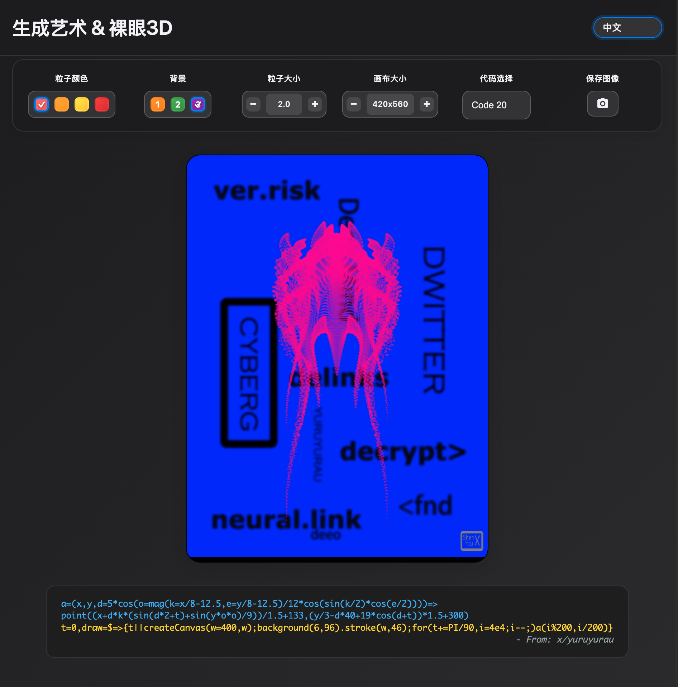

# 生成艺术与裸眼3D (Generative Art & Glasses-Free 3D)

[英文版](README.md) | [日文版](README_ja.md)

## 界面预览



## 背景

本项目旨在融合两种迷人的视觉艺术形式：**代码生成艺术** 与 **裸眼3D效果**，创造出一种沉浸式的交互体验。

### 公式起源：Dwitter 与代码艺术

项目中使用的核心数学公式，其风格和灵感主要起源于一个名为 **Dwitter.net** 的创意编码社区。Dwitter 是一个专门分享极短 JavaScript 代码（最初限制在140个字符内）生成视觉艺术的平台。这种极限挑战催生了一种独特的“代码高尔夫”文化，艺术家们通过精妙的数学和编程技巧，在极小的空间内创造出惊人复杂的动态视觉效果。

Twitter 用户 **[@ア](https://twitter.com/yuruyurau)** 是这个领域的杰出创作者之一。他创作并分享了大量此类精美的生成艺术公式，本项目中的大部分代码变体都来源于他的无私分享和启发。

### 裸眼3D原理：“色彩立体效应”

本项目的“裸眼3D”功能并非真正的三维渲染，而是巧妙地利用了一种名为 **“色彩立体效应”（Chromostereopsis）** 的视觉现象。其原理如下：

人眼的晶状体在折射不同波长的光线时，会产生微小的色差。波长较长的光（如红色）会聚焦在视网膜的稍后方，而波长较短的光（如蓝色）则聚焦在稍前方。大脑在处理这些信号时，会“误认为”红色物体离我们更近，而蓝色物体更远。

当我们将鲜艳的红色粒子放置在深蓝色的背景上时，这种效应尤为明显，从而产生自然的景深感，仿佛图像具有了三维结构。


### 戴上近视眼镜感觉更明显

近视眼镜是凹透镜，它本身也会产生色差。
当你戴上眼镜看手机时，光线需要先穿过眼镜的镜片，再穿过你眼睛的晶状体。这两个透镜的色差效应会叠加和放大。
这种放大作用使得红光和蓝光的焦点分离得更“远”，大脑接收到的“远近”信号就更强烈，因此你会感觉立体感“爆棚”。不同的眼镜材质和度数，放大的效果也会有所不同。

### 本项目的创新结合

本项目的核心贡献在于 **系统性地整理了这些精妙的2D生成艺术公式，并首次将它们与“色彩立体效应”相结合**。通过提供可定制的粒子和背景颜色选项，用户可以主动触发并控制这种裸眼3D效果的强度，将原本平面的数学艺术转化为具有立体感的动态画作，从而提供了一种全新的互动和欣赏方式。

## 功能特性

### 🎨 多样化的艺术效果
- **42种不同的代码变体**：每个变体都基于不同的数学公式，产生独特的视觉效果
- **实时动画**：基于时间变量的动态效果，呈现流畅的粒子运动
- **数学驱动**：使用三角函数、指数函数等数学函数生成艺术图案

### 🎛️ 可定制的视觉参数
- **粒子颜色**：4种预设颜色（红色、橙色、黄色、纯红色）
- **背景颜色**：4种背景选择（蓝色、青色、紫色、黑色）
- **粒子大小**：可调节范围 0.5-3.0
- **画布尺寸**：可调节基础尺寸 120-250 * (3 : 4), 即画布尺寸 360x480 - 750x1000

### 🌐 多语言支持
支持7种语言界面：
- 中文 (简体)
- English
- 日本語
- 한국어
- Deutsch
- Français
- العربية

### 📱 响应式设计
- 适配不同屏幕尺寸
- 移动端友好的操作界面
- 现代化的暗色主题设计

### 📸 图像保存功能
- **一键保存**：点击照相机图标即可保存当前艺术作品
- **智能命名**：自动生成包含代码版本和时间戳的文件名
- **高质量PNG**：保存为无损PNG格式，画质清晰
- **尺寸一致**：保存的图像尺寸与显示的画布尺寸完全一致

## 技术栈

- **HTML5 Canvas**：用于图形渲染
- **p5.js**：JavaScript创意编程库
- **CSS3**：现代化的样式设计
- **JavaScript ES6+**：核心逻辑实现
- **为便于部署采用单文件结构

## 项目结构

```
GenerativeArt3D/
├── genart3d.html           # 主要HTML文件
└── README.md              # 项目说明文档
```

## 快速开始

### 部署方式

#### 1. 本地部署
```bash
# 克隆项目
git clone <repository-url>
cd GenerativeArt3D

# 直接在浏览器中打开HTML文件
open genart3d.html
```

#### 2. Web服务器部署
```bash
# 使用Python启动简单HTTP服务器
python -m http.server 8000

# 或使用Node.js的http-server
npx http-server

# 然后在浏览器访问 http://localhost:8000
```

#### 3. GitHub Pages部署
1. 将项目上传到GitHub仓库
2. 在仓库设置中启用GitHub Pages
3. 选择主分支作为源
4. 访问 `https://YourUsername.github.io/YourRepo/genart3d.html`

#### 4. Netlify部署
1. 将项目文件夹拖拽到Netlify部署页面
2. 或连接GitHub仓库进行自动部署
3. 获得自动生成的访问链接

## 使用说明

### 基本操作
1. **选择艺术效果**：从下拉菜单选择不同的代码变体
2. **调整颜色**：点击色彩选择器改变粒子和背景颜色
3. **调节大小**：使用+/-按钮调整粒子大小和画布尺寸
4. **切换语言**：从语言下拉菜单选择界面语言
5. **保存图像**：点击照相机图标保存当前艺术作品为PNG文件

### 参数说明
- **代码选择**：42种不同的数学算法，每种产生独特效果
- **粒子颜色**：影响移动点的颜色
- **背景颜色**：设置画布背景色彩
- **粒子大小**：控制点的绘制粗细
- **画布大小**：调整整个画布的尺寸
- **保存图像**：将当前画布内容保存为PNG文件，文件名格式为 `generative-art-{代码版本}-{时间戳}.png`

## 数学原理

项目中的艺术效果基于复杂的数学公式，主要包括：

- **三角函数**：`sin()`, `cos()`, `tan()` 用于创建周期性运动
- **距离计算**：`mag()` 函数计算向量长度
- **时间变量**：`t` 变量驱动动画效果
- **坐标变换**：复杂的坐标映射和旋转

**重要提示**：当前项目实现主要针对基于 `point()` 函数进行逐点绘制的公式，也就是通常所说的“粒子系统”效果。对于使用线条 (`line()`) 或形状 (`rect()`, `ellipse()`) 等其他 p5.js 绘图函数的公式，可能无法直接适用或需要进行相应的代码改造。

示例公式：
```javascript
a=(x,y,d=mag(k=(4+sin(y*2-t)*3)*cos(x/29),e=y/8-13))=>
  point((q=3*sin(k*2)+.3/k+sin(y/25)*k*(9+4*sin(e*9-d*3+t*2)))+
        30*cos(c=d-t)+200,q*sin(c)+d*39-220)
```

## 浏览器兼容性

- Chrome 60+
- Firefox 55+
- Safari 12+
- Edge 79+

## 贡献指南

欢迎贡献新的艺术效果或改进现有功能！

1. Fork 项目
2. 创建功能分支：`git checkout -b feature/new-effect`
3. 提交更改：`git commit -am 'Add new artistic effect'`
4. 推送分支：`git push origin feature/new-effect`
5. 创建Pull Request

## 致谢

- 艺术算法来源：[@ア](https://twitter.com/yuruyurau) , [Dwitter](https://dwitter.net)
- p5.js创意编程库：[p5js.org](https://p5js.org/)
- 数学之美的灵感来源于自然界的几何图案

## 许可证

MIT License

## 联系方式

如有问题、建议或者提交新的公式，请创建GitHub Issue


---

*让数学与艺术在代码中完美融合* ✨ 